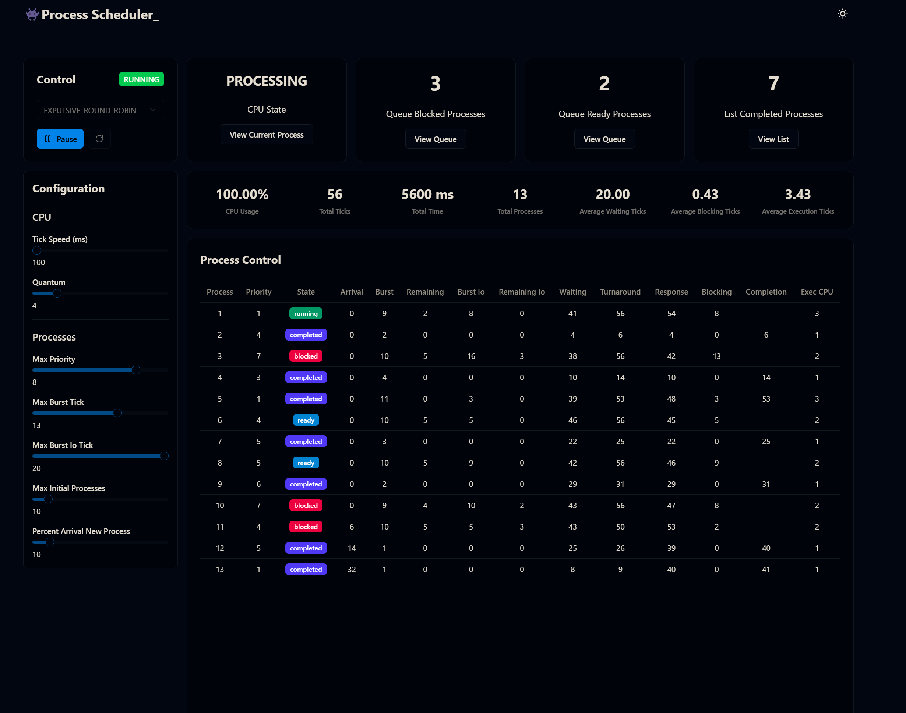

# 👾 Process Scheduler Simulator

To see the production version, click [here](https://ula-so-process-scheduler.vercel.app/).

## About this

This is a [Next.js](https://nextjs.org) project, created with [`create-next-app`](https://nextjs.org/docs/app/api-reference/cli/create-next-app). It includes a process scheduling simulator implementing the following algorithms:

### Preemptive Algorithms

- **Priority Scheduling:** Assigns a priority to each process, and the CPU always attends to the process with the highest priority. If a higher-priority process arrives, the current process is interrupted.
- **Round Robin:** Each process receives a fixed amount of time (quantum) to execute. If the process does not finish within this time, it is moved to the end of the queue, and another process takes over.
- **Shortest Remaining Time First (SRTF):** A variation of SJF where the process with the shortest remaining execution time is always selected next, even if it interrupts the currently running process.

### Non-Preemptive Algorithms

- **First Come, First Served (FCFS):** Processes execute in the order they arrive, without interruptions.
- **Priority Scheduling:** Similar to the preemptive version, but once a process starts execution, it cannot be interrupted.
- **Random Scheduling:** Randomly selects a process from the ready queue for execution.
- **Shortest Job First (SJF):** Executes the process with the shortest estimated execution time first, without preempting ongoing processes.

## User Interface

The simulator features an interactive UI displaying process execution details in real-time. The main UI elements include:

- **Control Panel:** Allows pausing and resuming execution, selecting scheduling algorithms, and adjusting configurations.
- **Processing Status:** Displays the current CPU state and the number of blocked and ready processes.
- **Performance Metrics:** Shows CPU usage, total ticks, total processes, and average execution statistics.
- **Process Control Table:** Lists all active processes with details like priority, state, burst time, remaining time, waiting time, and turnaround time.



## Project Structure

The project is divided into two parts:

1. **Graphical Interface (Frontend):** Built with Next.js for visualizing the scheduling algorithms. The UI runs on the client and is composed of [Tailwind CSS](https://tailwindcss.com/) and components from [shadcn/ui](https://ui.shadcn.com/).
2. **Simulation Logic (Backend):** Manages processes and executes the scheduling algorithms.

All simulator-related logic is located in `./src/libs`. The project uses TypeScript, with type definitions stored in `./src/lib/types.ts`.

The simulator is based on a **Base Simulator** class, with each algorithm having a child class that inherits the base functionality. Each child class only implements the process scheduler and a method to sort the ready queue. Additionally, the **Simulator** class uses a `notify` function to inform the UI of changes, ensuring real-time synchronization.

### Handling Blocked Processes

To simulate I/O operations, when generating random processes, if the **burst time** is greater than 5, a **burst I/O** time is assigned. When the process reaches half of its execution, it is blocked to "simulate disk writing." Once unblocked, it is reinserted into the ready queue and resumes execution according to the active scheduling algorithm on the next context switch.

Blocked processes are stored in a **Blocked Queue**, which manages their transitions back into the ready queue after I/O completion.

## Getting Started

To run the project locally:

```bash
git clone git@github.com:EnderPuentes/ula-so-process-scheduler.git process-scheduler
cd process-scheduler
pnpm install
pnpm dev
```

Open [http://localhost:3000](http://localhost:3000) in your browser to see the application.

You can start editing the application by modifying `app/page.tsx`. The page auto-updates as you make changes.

This project uses [`next/font`](https://nextjs.org/docs/app/building-your-application/optimizing/fonts) to optimize and load [Geist](https://vercel.com/font), a modern font family from Vercel.

## Learn More

To learn more about Next.js, check out these resources:

- [Next.js Documentation](https://nextjs.org/docs) - Learn about Next.js features and APIs.
- [Learn Next.js](https://nextjs.org/learn) - An interactive tutorial.
- [Next.js GitHub Repository](https://github.com/vercel/next.js) - Your feedback and contributions are welcome.

## Deploy on Vercel

The easiest way to deploy your Next.js application is through the [Vercel Platform](https://vercel.com/new?utm_medium=default-template&filter=next.js&utm_source=create-next-app&utm_campaign=create-next-app-readme), created by the Next.js team.

Check out the [Next.js Deployment Documentation](https://nextjs.org/docs/app/building-your-application/deploying) for more details.

## License

For more details, please refer to the [LICENSE](./LICENSE.md) file.
